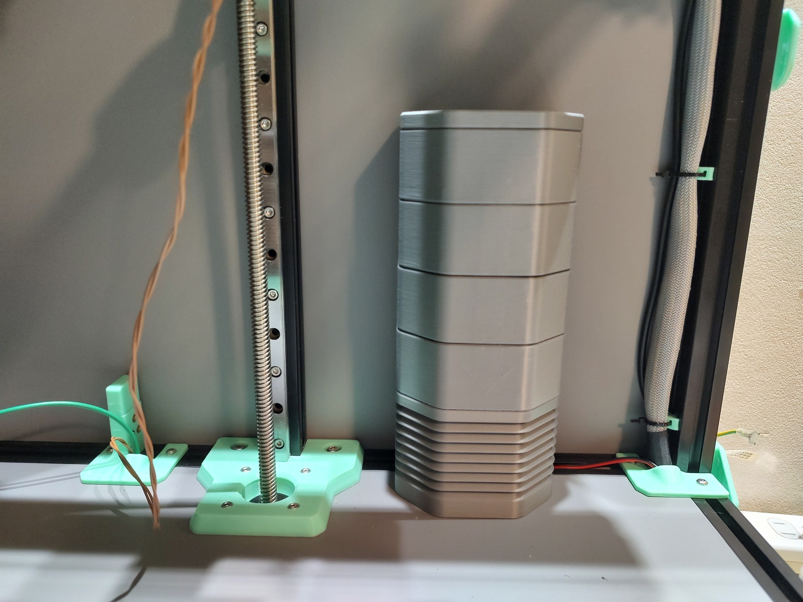
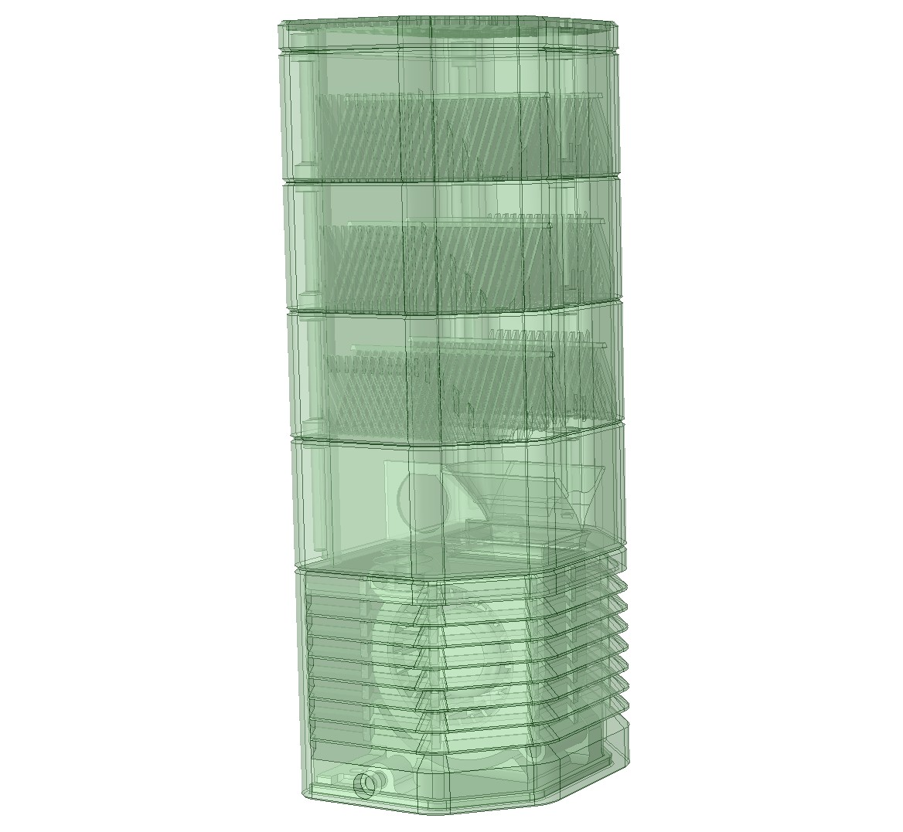

# Activated Carbon Filter for VORON TRIDENT

# BOM
- M3 x 10mm SHCS x17 (Steel)
- M3 x 25mm BHCS x2
- M3 Insert Nut x6
- M3 Roll-in T-nut x1
- 6x3mm Neodimium Magnet x12
- 50x20 Blower Fan Gdstime GDB5020(24V) or Sunon GB1205PKV1-8AY(12V) x1

